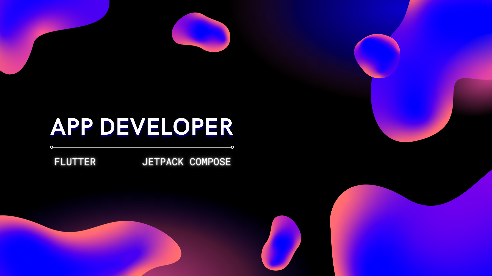

-  I’m currently learning [Jetpack Compose](https://developer.android.com/jetpack/compose)

-  All of my projects are available at [https://sanjeevmadhav.com](https://sanjeevmadhav.com)

-  Ask me about **Flutter**

-  How to reach me **sanjeevmadhav03@gmail.com**

-  My pub.dev [packages](https://pub.dev/publishers/sanjeevmadhav.com/packages) 

 

 
<h3>🎮 Playstore:</h3>
 
  <a href="https://play.google.com/store/apps/details?id=com.sanjeev.penguin_chat_game">Multiplayer Online Game</a> | Flutter | Flame engine
 
 
<video width="240" height="240" controls autoplay>
  <source src="assets/penguin_chat_demo.mp4" type="video/mp4">
  Your browser does not support the video tag.
</video>
 
 
  <a href="https://play.google.com/store/apps/details?id=com.sanjeev.flutter_encrypto">File Encryption App</a> | Flutter
 
 
<video width="240" height="240" controls autoplay>
  <source src="assets/encrypto_demo.mp4" type="video/mp4">
  Your browser does not support the video tag.
</video>
 
<h3 align="left">👨‍💻 Languages and Tools:</h3>
 
<table>
    <tbody>
        <tr>
            <td>
            </td>
            <td>
          </td>
            <td>
          </td>
        </tr>
        <tr>
          <td>
            </td>
            <td></td>
            <td></td>
        </tr>
    </tbody>
</table>

 

<h3 align="left">🤝 Connect with me:</h3>
 

### 

